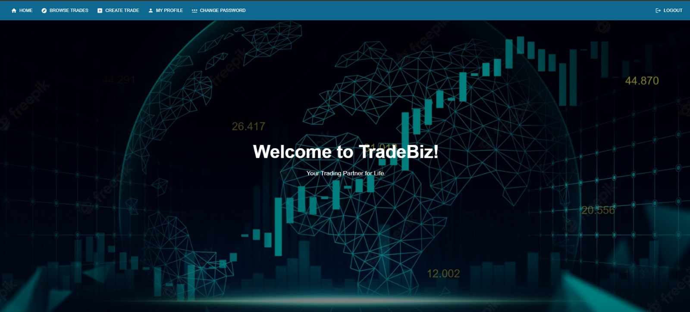
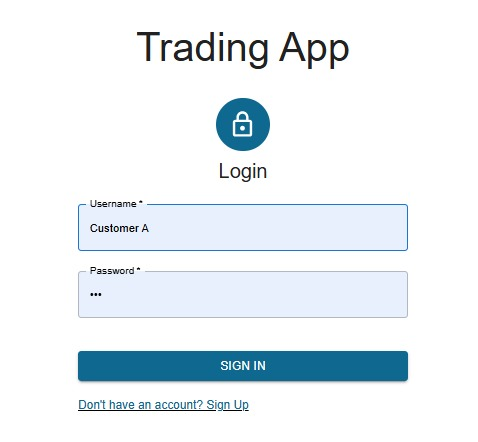
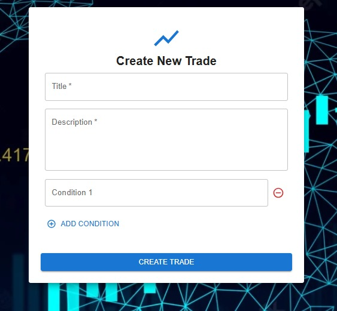
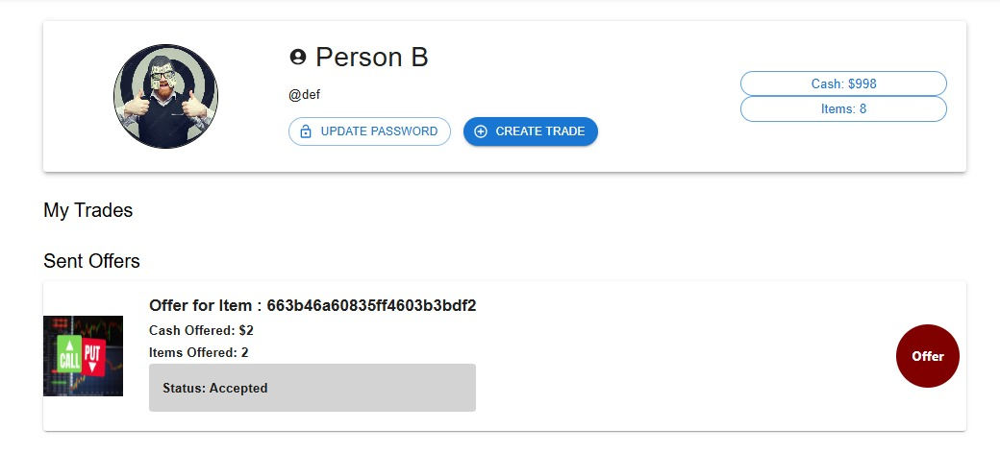

<h1 align="center">TradeBiz — Real-time Trading Platform</h1>

<p align="center">
  <b>A full-stack marketplace where users can trade items with cash and live offers, powered by the MERN stack and Socket.IO</b>
</p>

---

## 📦 About the Application

TradeBiz is a simulated trading system that allows users to:
- Create trades by specifying title, description, and conditions
- Offer trades in real time using items and/or cash
- Accept or reject incoming offers live using WebSockets
- Navigate a fully-featured UI with authentication and persistence

---

## 🚀 Features

- 🔐 **Authentication** with secure login/signup and password change
- 📡 **Real-time Offers** using Socket.IO rooms
- 🛍️ **Live Trade Listings** with filtering
- 🧠 **Backend** using Express, Mongoose, and MongoDB
- 🎨 **Frontend** built with React + TypeScript

---

## 📂 Code Structure

```
├── backend
│   ├── controllers
│   ├── models
│   ├── routes
│   └── app.js
├── frontend
│   ├── public
│   ├── src
│   │   ├── components
│   │   ├── pages
│   │   ├── context
│   │   ├── layouts
│   │   └── App.tsx
```

---

## 🖼️ UI Screenshots

### 🏠 Home Page


### 🔐 Login Page


### 📄 Create New Trade


### 👤 Profile Page


---

## 🛠️ Tech Stack

- **Frontend**: React, TypeScript, CSS
- **Backend**: Express, MongoDB, Mongoose
- **Real-time**: Socket.IO
- **Authentication**: JWT

---

## 🧪 Run Locally

```bash
# Backend
cd backend
npm install
npm run dev

# Frontend
cd frontend
npm install
npm start
```

---

## 📫 Contact

For inquiries, reach out at `25100147@lums.edu.pk`

---

<p align="center"><i>"Your Trading Partner for Life."</i></p>
